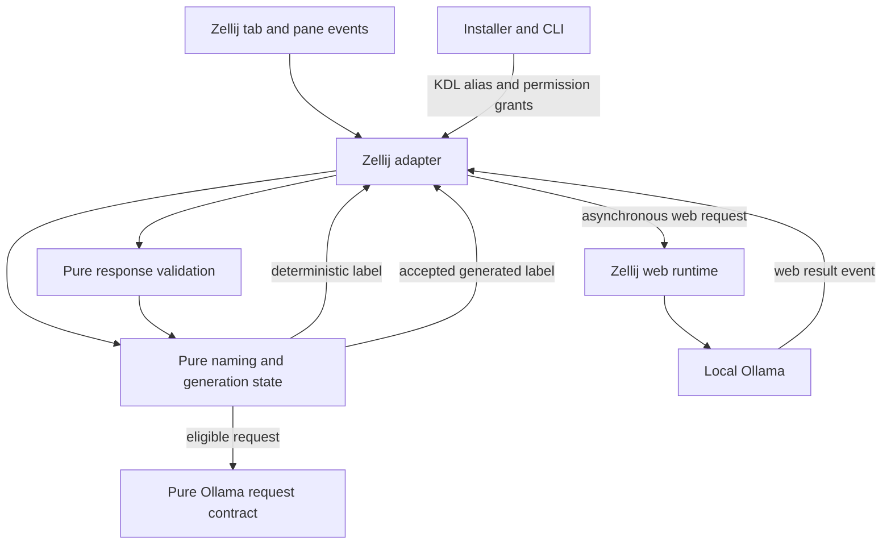
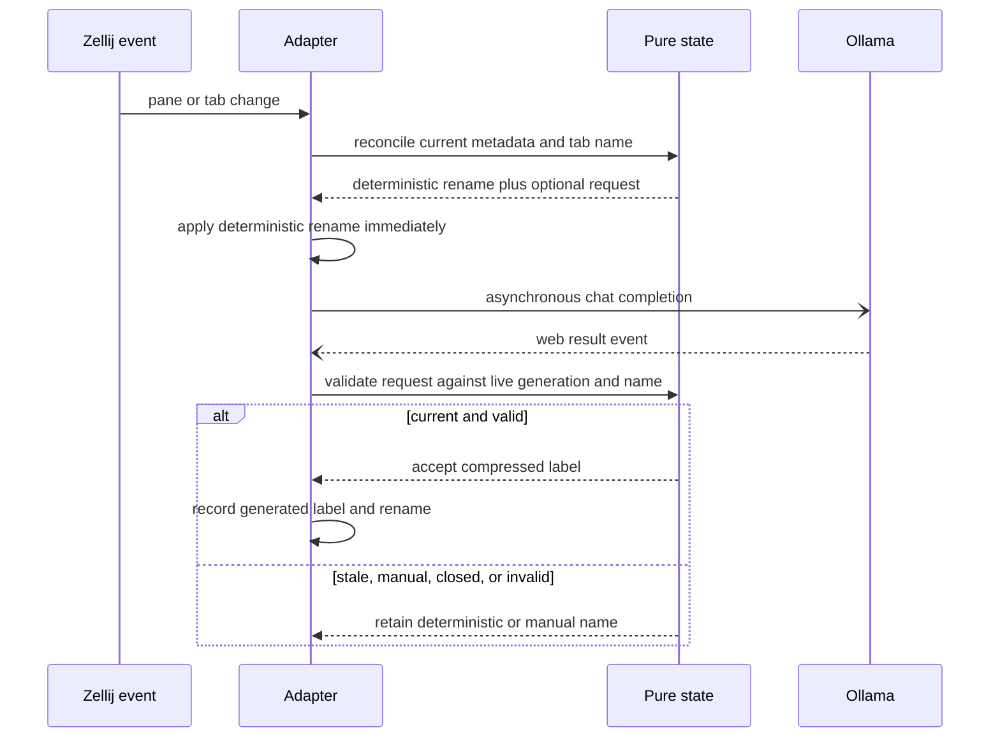
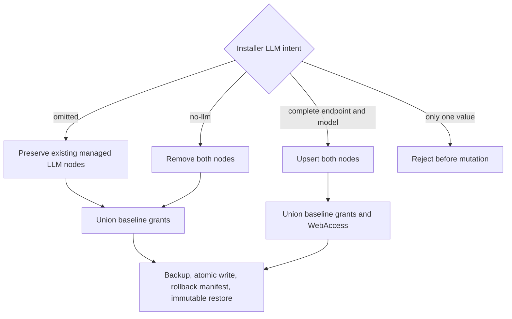

# Native Ollama Compression - Plan

## Goal Capsule

- **Objective:** Prepare v0.2.0 so the native headless Zellij plugin can optionally refine long deterministic tab labels through a local Ollama OpenAI-compatible endpoint without blocking naming or weakening manual overrides.
- **Authority:** The current user request and session-settled decisions outrank this plan; verified repository behavior and the locked Zellij API constrain implementation details.
- **Execution profile:** Build the pure race-safe state machine first, integrate it with Zellij events, migrate installer configuration and permissions, then update versioning and documentation before automated and live verification.
- **Stop conditions:** Stop if the implementation would require pane contents, synchronous inference, secrets in KDL, weakening installer rollback safety, or publishing a tag or release.
- **Tail ownership:** This change may be committed, pushed, opened as a pull request, and watched through CI. Creating or pushing `v0.2.0` remains a separate explicit action.

---

## Product Contract

### Summary

Add opt-in, metadata-only Ollama compression as a second-stage refinement of the native plugin's existing deterministic tab names, with safe installer upgrades and release-ready v0.2.0 metadata.

### Problem Frame

The native plugin already removes default numbered tab drift using pane titles and deterministic project/activity fallbacks, but long titles are truncated rather than compressed into a compact task label. The Python watcher can call an OpenAI-compatible endpoint, yet the headless WASM path cannot currently do so without the watcher.

The native event loop must remain responsive when Ollama is cold, stopped, overloaded, or unreachable. A late result must never cross tabs, apply to stale metadata, or overwrite a manual rename. Headless permissions also require installer-managed pre-grants because a user cannot reliably accept the prompt in a focusable pane.

### Requirements

**Native naming behavior**

- R1. With no complete native LLM configuration, the plugin preserves v0.1.0 deterministic naming and requests no web permission.
- R2. With native LLM enabled, the plugin applies the deterministic shortened label immediately and performs inference asynchronously.
- R3. The plugin reads and sends only the selected pane-title text or already-derived fallback label plus the character limit; it never reads or sends pane contents, scrollback, raw cwd, full commands, environment data, manual tab names, tab IDs, or filesystem/plugin paths.
- R4. A request is eligible only when the canonical unshortened source exceeds `max_chars`; short labels remain entirely local.
- R5. Only a successful current response containing one nonempty line within `max_chars`, free of controls, Unicode separators, bidi controls, and invisible format characters, may replace the deterministic fallback.
- R6. Non-2xx responses, transport failures, oversized bodies, invalid JSON, missing content, and invalid labels silently retain the deterministic fallback.
- R7. Native refinement permits at most two global host requests, one in-flight request per tab, and one coalesced latest queued generation per live tab; late, unknown, closed-tab, cross-tab, or superseded responses are ignored.
- R8. A manual tab name always wins, including when it is applied while an LLM request is in flight.

**Installer and permission behavior**

- R9. WASM installation writes and reconciles `max_chars`, `llm_base_url`, and `llm_model` inside one managed alias while preserving unrelated nodes, comments, and a single `load_plugins` entry.
- R10. A complete native LLM configuration automatically pre-grants `WebAccess` along with the plugin's baseline application-state permissions; disabled native LLM does not add `WebAccess`.
- R11. The permission allowlist uses current Zellij names, including `RunCommands` and `WebAccess`, and rejects the stale `RunCommand` spelling.
- R12. Configuration and permission changes retain transactional backups, rollback, symlink refusal, normalized permission-cache keys, dry-run reporting, original-byte restoration, and macOS immutable-flag restoration, then reopen and validate final KDL and flag state before success.

**Release preparation and operations**

- R13. All package version declarations and the Cargo lockfile identify v0.2.0 consistently.
- R14. Documentation distinguishes Python watcher and native WASM LLM configuration, explains Ollama setup, data disclosure (including redirects), deterministic fallback, manual override safety, permissions, manual `WebAccess` revocation after `--no-llm`, diagnostics, and fresh-server restart requirements.
- R15. The existing artifact workflow continues to check, build, package, checksum, and conditionally publish immutable assets without publishing during this work.
- R16. Automated verification, a controllable local OpenAI-compatible stub, and a live Zellij/Ollama smoke test prove fallback-first behavior, asynchronous upgrade, permission denial, unavailable-server fallback, bounded hung requests, redirect behavior, and manual-rename protection.
- R17. The fixed native prompt asks for one concise label that preserves distinguishing project and activity meaning and invents no facts; a representative title corpus supports a documented qualitative smoke observation without becoming a nondeterministic release gate or adding semantic enforcement to runtime code.
- R18. Native refinement emits bounded, non-sensitive diagnostic categories for incomplete configuration, permission denial, transport failure, HTTP status class, validation rejection, and scheduler saturation; it never logs source text, prompt bodies, response bodies, or complete endpoint URLs, and repeats each generation-scoped category at most once per generation.

### Acceptance Examples

- AE1. Given no native LLM endpoint, when pane metadata changes, then the tab receives the same deterministic label as v0.1.0 and no web request is created.
- AE2. Given a long title and working Ollama configuration, when reconciliation runs, then the deterministic label appears immediately and a valid shorter model label replaces it later.
- AE3. Given a request in flight, when the source changes, the tab closes, or the user manually renames the tab, then the late response makes no visible change.
- AE4. Given an unchanged source whose request fails or never returns, when later pane and timer bursts occur, then the deterministic name remains and no request storm begins.
- AE5. Given an existing v0.1.0 plugin alias, when the installer enables native Ollama, then it upgrades the same alias and permission entry idempotently without duplicating managed nodes or load entries.
- AE6. Given Ollama is stopped, when a long title is reconciled, then deterministic naming continues without waiting for or surfacing the network failure.
- AE7. Given two host requests never return, when titles and events continue changing across tabs, then no additional host request is dispatched, deterministic renames continue, and retained coordinator state remains bounded by live tabs.
- AE8. Given representative long titles for coding, review, debugging, and documentation work, when the supported local model compresses them, then outputs remain recognizable, fact-grounded, and distinct from one another while improving on blind truncation.

### Scope Boundaries

**Included**

- Local OpenAI-compatible Ollama chat completions for the native WASM plugin.
- Pure request serialization, response validation, permission readiness, globally bounded scheduling, per-tab generation/correlation state, bounded live-tab caching, and event-adapter integration.
- Installer and CLI migration for conditional native configuration and permissions.
- v0.2.0 documentation, version consistency, release build, and local smoke verification.

**Deferred to Follow-Up Work**

- Authenticated remote providers, API-key/session-environment design, provider selection, retries, cooldowns, and configurable prompts.
- Timer-driven request expiry or cancellation; Zellij 0.44 exposes neither request cancellation nor per-call timeout.
- New agent, MCP, or autonomous configuration surfaces.

**Outside this release**

- Reading or transmitting visible pane contents or scrollback.
- Creating or pushing a v0.2.0 tag, replacing an existing release asset, or publishing a GitHub Release.

---

## Planning Contract

### Key Technical Decisions

- KTD1. Native LLM compression is opt-in and the unconfigured path remains behaviorally identical to v0.1.0. (session-settled: user-approved — chosen over always-on inference: deterministic offline behavior must remain the default.)
- KTD2. The first native integration targets local Ollama's OpenAI-compatible `/v1/chat/completions` endpoint without credentials. (session-settled: user-approved — chosen over generic authenticated providers: local inference meets the current need without introducing secret handling.)
- KTD3. Deterministic naming happens first and model output is an asynchronous refinement. (session-settled: user-directed — chosen over synchronous inference: a cold or unavailable model must never delay tab naming.)
- KTD4. Requests carry only selected title or derived label metadata and the length limit. (session-settled: user-directed — chosen over pane-content inference: visible terminal content and scrollback are outside the data contract.)
- KTD5. Manual names have precedence over every automatic result. (session-settled: user-approved — chosen over unconditional model upgrades: user intent must survive in-flight responses.)
- KTD6. Release preparation stops before tag or release publication. (session-settled: user-directed — chosen over automatic publication: immutable release creation requires a separate explicit request.)
- KTD7. Pure state owns source derivation, generations, deduplication, response acceptance, and generated-name tracking; `rust/src/main.rs` remains a thin Zellij adapter.
- KTD8. The coordinator uses a fixed global in-flight cap of two, one in-flight request per tab, and one coalesced latest queued generation per live tab. Queued work is revalidated before fair deterministic dispatch; source churn replaces queued work instead of spawning host requests.
- KTD9. Timers remain debounce-only in v0.2.0. A hung request retains its slot because Zellij exposes no timeout or cancellation; once both slots hang, refinement pauses until a response or fresh server while deterministic naming continues.
- KTD10. Validation rejects rather than truncates model output, rejects normalized sources over 4 KiB from inference, caps response parsing at 64 KiB, and uses Unicode character counts consistent with deterministic shortening. Requests remain non-streaming with a bounded output-token budget.
- KTD11. Installer LLM inputs are tri-state: omitted flags preserve existing managed LLM nodes, complete explicit values enable or update them, and `--no-llm` removes them and prevents the installer from adding `WebAccess` without revoking an existing shared grant.
- KTD12. The current artifact pipeline remains unchanged unless verification exposes a real incompatibility; it already builds and releases the exact checked WASM bytes.
- KTD13. Plugin configuration is immutable for one server/plugin instance. Installer changes require a fresh server; the effective configuration fingerprint is used only for request correlation, not hot reload.
- KTD14. Native web readiness is distinct from configuration completeness: disabled, awaiting permission, granted, and denied states all retain deterministic naming, and dispatch occurs only after `WebAccess` is granted or pre-granted.
- KTD15. The fixed prompt is serialized from constants in `rust/src/llm.rs`: system message `Return exactly one concise terminal tab label. Preserve distinguishing project and activity meaning. Do not invent facts. Output only the label.` and user template `Shorten this title to at most {max_chars} characters: {source}`. Only `max_chars` and the canonical metadata source are interpolated, with a bounded output-token budget.

### Assumptions

- Native v0.2.0 accepts only unauthenticated loopback HTTP bases (`localhost`, `127.0.0.1`, or `[::1]`) with no query, fragment, or credentials; broader endpoints belong to the deferred authenticated-provider design.
- Both `llm_base_url` and `llm_model` are required to enable native LLM behavior. Incomplete direct KDL configuration silently leaves native LLM disabled, while installer input with only one value is rejected before mutation.
- Omitted installer LLM flags preserve an existing alias during artifact-only upgrades; explicit `--no-llm` is the only removal signal.
- WASM installation automatically unions `ReadApplicationState` and `ChangeApplicationState` into effective grants, plus conditional `WebAccess`, because all are required for a headless installation to function.
- Zellij request context carries an opaque request identifier; tab, generation, source fingerprint, and expected fallback remain in live plugin state and must match before acceptance.
- Response bodies larger than 64 KiB are invalid for this one-line label contract.
- Zellij 0.44 follows redirects and buffers the full response before emitting the plugin event. Loopback validation reduces accidental disclosure, but documentation must warn that a loopback server can redirect title metadata and that the 64 KiB limit bounds plugin parsing rather than host buffering.
- Explicit `--no-llm` removes managed alias nodes but does not revoke a pre-existing `WebAccess` grant because the shared permission cache has no ownership metadata; it prevents new automatic web grants and documentation explains manual revocation.

### High-Level Technical Design

The diagrams define the required relationships and lifecycle; the implementation may choose internal type and helper names that preserve these contracts.

```mermaid
stateDiagram-v2
  [*] --> LocalOnly: LLM disabled or source short
  [*] --> AwaitingPermission: long source and complete config
  AwaitingPermission --> Eligible: WebAccess granted
  AwaitingPermission --> LocalOnly: WebAccess denied
  Eligible --> Pending: one request dispatched
  Pending --> Applied: current valid response
  Pending --> Retained: failure or invalid response
  Pending --> Superseded: source changes
  Pending --> Protected: manual rename
  Pending --> Closed: tab close
  Applied --> Eligible: new source generation
  Retained --> Eligible: new source generation
  Superseded --> Eligible: new current generation
  Protected --> [*]: tab closes; manual protection lasts for the tab lifetime
  Closed --> [*]: evict tab state
```

### Sequencing

Implement the pure Rust contracts before event-side effects, then migrate installer state before documentation and live smoke verification. This ordering makes race and safety behavior executable in unit tests before it is exercised inside a live Zellij server.

### System-Wide Impact

- **Runtime lifecycle:** Zellij events may arrive before permission resolution. Deterministic naming is valid in every permission state; a model result is accepted only when the latest received tab snapshot already contains the exact expected generated name. Results arriving before that observation are discarded rather than cached. The adapter relies on Zellij's delivered event order, and the controllable integration harness must falsify manual-rename safety with delayed and deliberately reordered result delivery before live smoke acceptance.
- **Resource lifecycle:** Coordinator memory is O(live tabs plus the two in-flight slots). Each tab retains only current generation/outcome, one queued generation, and any capped in-flight tombstone; tab close or manual override evicts queued/current refinement state.
- **Configuration lifecycle:** Native KDL is parsed once per plugin instance and requires a fresh server after installer changes. Python watcher configuration retains its existing persistence semantics even when `--mode both` supplies the same endpoint/model values to both runtimes.
- **Permission lifecycle:** `permissions.kdl` is shared, path-keyed security state. Automatic grants remain least-privilege, immutable-state changes are restored on every path, and replacing bytes at an already-granted path does not itself revoke trust.
- **Disclosure boundary:** Native inference sends selected pane-title or derived fallback text to the configured loopback service. Pane titles can contain sensitive text, and Zellij-followed redirects are a documented residual disclosure risk.

### Risks and Dependencies

- **Uncancellable host requests:** Two hung requests permanently saturate refinement for that plugin instance. The cap prevents unbounded concurrency; deterministic naming remains the operational fallback until a response or fresh server.
- **Failure recovery:** A terminal failure is cached for an unchanged source generation. Starting or recovering Ollama refines existing tabs only after their canonical source changes or the Zellij server restarts; automatic retries and cooldowns remain deferred to avoid request storms.
- **Stale observed tab state:** Applying immediately from an old `TabInfo` snapshot can overwrite a manual rename. Results wait for a confirming tab update and exact current-generated-name match.
- **Untrusted endpoint and output:** Runtime and installer share conformance cases for structural loopback URL validation; response validation rejects terminal controls, bidi/invisible formatting, oversized input/output, malformed bodies, and all non-2xx statuses without logging source or response data.
- **Shared immutable permission cache:** A failed write or incorrect `uchg` restoration can affect unrelated plugins. Mutation records original bytes/flag state, validates the final canonical entry, and live smoke work uses a backup with servers stopped.
- **Host-side buffering:** The plugin cannot prevent Zellij from buffering an oversized response. Loopback-only endpoints, the fixed concurrency cap, and a controlled stub test limit and expose the residual risk.
- **Version compatibility:** The locked graph combines `zellij-tile` 0.44.0 with Zellij utilities 0.44.3 and runs under Zellij 0.44.3's Wasmi runtime, so locked target build plus real-host smoke evidence is required.

### Sources and Research

- `rust/src/main.rs` and `rust/src/naming.rs` establish the existing adapter/pure-policy split and manual-name tracking.
- `src/zellij_tab_namer/installer.py` provides exact KDL matching, backups, rollback, symlink refusal, normalized permission keys, and immutable-file handling that the migration must preserve.
- `docs/solutions/architecture-patterns/reproducible-wasm-artifact-release-pipeline.md` defines the checked-byte artifact and immutable-release contract.
- [Zellij web request command](https://zellij.dev/documentation/plugin-api-commands.html#web_request) and [web result event](https://zellij.dev/documentation/plugin-api-events.html#webrequestresult) confirm asynchronous context-correlated requests with no per-call timeout or cancellation.
- [Zellij permission types](https://zellij.dev/documentation/plugin-api-types.html#permissiontype) confirms `WebAccess` and `RunCommands`.
- [Ollama OpenAI compatibility](https://docs.ollama.com/api/openai-compatibility) defines non-streaming `/v1/chat/completions` and `choices[0].message.content`; [Ollama API errors](https://docs.ollama.com/api/errors) supports status-first fallback handling.

---

## Implementation Units

### U1. Pure native naming and Ollama state

- **Goal:** Add testable source derivation, request construction, response validation, and per-tab generation state without Zellij side effects.
- **Requirements:** R2-R8, R17; KTD3-KTD5, KTD7-KTD10.
- **Dependencies:** None.
- **Files:** `rust/src/naming.rs`, `rust/src/llm.rs`, `rust/src/lib.rs`, `tests/fixtures/loopback_url_cases.json`, `Cargo.toml`, `Cargo.lock`.
- **Approach:** Preserve canonical source text before deterministic shortening; model live-tab generation, current generated label, bounded global scheduling, pending/queued work, and current-source outcome. Serialize a minimal non-streaming chat completion with direct `serde` and `serde_json` dependencies. Accept results only through live state, not echoed context alone.
- **Execution note:** Start with failing unit tests for race acceptance and response validation before adding the state transitions.
- **Patterns to follow:** Pure policy and inline library tests in `rust/src/naming.rs`; direct pinned dependencies and locked builds in `Cargo.toml`.
- **Test scenarios:**
  - Covers AE1. Disabled or incomplete configuration produces the existing deterministic decision and no request.
  - Covers AE2. A long canonical source produces the deterministic label plus one request, while a short source produces no request.
  - Duplicate events for the same tab/source/config generation do not duplicate a request, including after terminal failure.
  - A current valid response updates the generated label for the intended tab and a cached identical result causes no rename churn.
  - Covers AE3. Old generation, unknown request, closed tab, reused tab ID, and cross-tab responses are ignored.
  - Covers AE3. A manual rename during flight is preserved, including a response arriving before the deterministic rename is observed.
  - Covers AE4. Pending or failed unchanged generations are not retried by repeated reconciliation.
  - Covers AE7. Thousands of source changes, failures, closes, and late results preserve a two-request global cap, one coalesced queue entry per live tab, and stable state cardinality.
  - Non-2xx, body over 64 KiB, invalid UTF-8/JSON, absent choice/content, empty, multiline, control/bidi/invisible-containing, and over-limit content retain the fallback.
  - A normalized source larger than 4 KiB is ineligible for inference and retains the deterministic label, while a source just under the cap remains eligible.
  - Endpoint normalization handles `/v1` and `/v1/`, rejects deceptive/non-loopback forms, and the serialized request is non-streaming, bounded, and metadata-only; Rust reads the shared loopback URL fixture used by the Python suite.
  - The prompt contract explicitly preserves project/activity meaning, forbids invented facts, and requests one label only.
- **Verification:** Library tests demonstrate every lifecycle and validation branch without a running Zellij server or Ollama process.

### U2. Zellij asynchronous event integration

- **Goal:** Wire the pure coordinator into the headless plugin while keeping deterministic reconciliation immediate and timers debounce-only.
- **Requirements:** R1-R8; KTD1-KTD5, KTD7-KTD10.
- **Dependencies:** U1.
- **Files:** `rust/src/main.rs`, `rust/src/adapter.rs`, `rust/src/naming.rs`, `rust/src/llm.rs`, `rust/src/lib.rs`.
- **Approach:** Extract host-independent adapter action planning into `rust/src/adapter.rs` with typed permission, subscription, rename, and web-request actions whose ordering is testable through the library target. Parse immutable native configuration once, model permission readiness, conditionally request `WebAccess` and subscribe to `WebRequestResult`, dispatch `HttpVerb::Post` only from the bounded scheduler with an opaque request ID, and route results back through live-state acceptance. Keep `main.rs` as the thin Zellij action executor. Discard a result received before the deterministic fallback is observed in the latest tab snapshot; record an accepted model label as generated before renaming so later reconciliation does not classify it as manual.
- **Patterns to follow:** Existing `ZellijPlugin` adapter, `schedule_update` debounce, stable-ID renames, pane eligibility, and manual-override decisions.
- **Test scenarios:**
  - Covers AE1. Unconfigured load requests only application-state permissions and excludes web-result subscription.
  - Covers AE2. Reconciliation emits the deterministic rename before dispatching an eligible web request.
  - Covers AE3. Result routing cannot apply when current tab state no longer matches the expected generated label.
  - A result arriving before fallback observation is discarded, deliberately reordered results cannot bypass the latest observed manual name, and permission denial never marks a generation attempted.
  - Independent requests for two live tabs cannot cross-apply even when their responses arrive in reverse order.
  - Web results never clear or trigger the debounce flag, and timer events retain their existing meaning.
  - Each non-sensitive diagnostic category is emitted at most once per generation without source, prompt, response-body, or complete-URL data.
- **Verification:** Library tests assert action ordering and permission-state transitions through the extracted adapter planner; locked Clippy and the `wasm32-wasip1` release build prove the executor uses the pinned Zellij API and compiles for the actual plugin target.

### U3. Installer configuration and permission migration

- **Goal:** Make native Ollama installation and v0.1.0 upgrades safe, explicit, conditional, and idempotent.
- **Requirements:** R9-R12; KTD1, KTD2, KTD11.
- **Dependencies:** U1 for the finalized configuration contract.
- **Files:** `src/zellij_tab_namer/installer.py`, `src/zellij_tab_namer/cli.py`, `tests/test_installer.py`, `tests/test_cli.py`, `tests/fixtures/loopback_url_cases.json`.
- **Approach:** Reconcile only managed alias nodes, preserve unrelated KDL, model omitted/enable/disable intent, structurally validate loopback endpoint and complete model pairing, derive least-privilege baseline and conditional web grants, and correct the permission enum allowlist. Keep validation and artifact integrity checks before permission mutation, then verify final KDL bytes, canonical key, grants, and immutable state.
- **Execution note:** Add upgrade and rollback-oriented tests before changing the KDL reconciler because existing aliases are durable user configuration.
- **Patterns to follow:** Exact-node matching, balanced-KDL refusal, normalized permission keys, backup manifest, rollback, symlink checks, dry-run operations, and immutable-file restoration in `installer.py`.
- **Test scenarios:**
  - Covers AE5. A new enabled alias contains one each of `max_chars`, endpoint, model, and load entry; rerunning is byte-idempotent.
  - Covers AE5. A v0.1.0 alias upgrades in place, and changed managed values update without disturbing unknown child nodes or comments.
  - Omitted LLM flags preserve existing settings, `--no-llm` removes them, and partial enable input is rejected before any write.
  - Enabled native LLM automatically grants baseline permissions and `WebAccess`; disabled native LLM grants baseline permissions without `WebAccess`.
  - Runtime and installer load the same checked-in URL fixture and accept or reject every case identically, including IPv6 loopback, lookalike hosts, userinfo, query/fragment, malformed ports, unsupported paths, controls, and overlong values.
  - Explicit permissions are unioned and deduplicated; `RunCommands` is accepted while `RunCommand` is rejected.
  - CLI arguments reach WASM wiring, `--no-llm` wins explicitly, and dry-run reports changes without writing.
  - Existing rollback, symlink, normalized-key, malformed-KDL, and immutable-flag regression tests remain green, including failure injection restoring original bytes and `uchg` state.
- **Verification:** The Python unit suite proves new/install/upgrade/disable/dry-run paths and all existing safety invariants.

### U4. Version and operator documentation

- **Goal:** Make the source tree and installation guidance consistently describe the prepared v0.2.0 behavior.
- **Requirements:** R13-R15; KTD2, KTD4, KTD6, KTD12.
- **Dependencies:** U2, U3.
- **Files:** `Cargo.toml`, `Cargo.lock`, `pyproject.toml`, `setup.cfg`, `src/zellij_tab_namer/__init__.py`, `README.md`.
- **Approach:** Synchronize version declarations, document Ollama serve/pull and native installer examples, explain exact data and permission behavior, and verify rather than casually rewrite the release workflow.
- **Test scenarios:**
  - Cargo metadata and all Python version declarations report `0.2.0`.
  - README examples use a loopback endpoint, no fake API key for native mode, and include `WebAccess` plus the fresh-server requirement.
  - Workflow inspection confirms pull requests still build/package without release authority and only a matching pushed tag can publish immutable assets.
- **Verification:** Version searches, Cargo metadata, documentation review, and workflow inspection show no stale v0.1.0 operator guidance except intentional historical references.

### U5. Automated and live integration verification

- **Goal:** Prove the release artifact and real Zellij/Ollama lifecycle meet the product contract without publishing.
- **Requirements:** R15-R17; AE1-AE8; KTD3-KTD6, KTD12.
- **Dependencies:** U1-U4.
- **Files:** `target/wasm32-wasip1/release/zellij-tab-namer.wasm` (generated), `dist/zellij-tab-namer.wasm` (generated when packaging is exercised), separate machine-local Zellij configuration and permission cache for smoke testing.
- **Approach:** Run all locked Rust and Python checks before installing the local artifact. Use a controllable loopback stub for delayed, reversed, redirected, oversized, malformed, denied, and never-returning cases. Then preserve the permission cache's immutable policy, start a fresh Zellij server, verify real Ollama interoperability, and restore machine-local smoke configuration after testing.
- **Execution note:** Prefer observable runtime smoke evidence after automated checks; do not infer live success from unit tests alone.
- **Patterns to follow:** `docs/solutions/architecture-patterns/reproducible-wasm-artifact-release-pipeline.md` and the installer-managed permission/cache workflow.
- **Test scenarios:**
  - Covers AE2. Live Ollama and a long title show a deterministic name first, then a valid compressed name without blocking the Zellij session.
  - Covers AE6. Stopped Ollama leaves deterministic naming operational and stable.
  - Covers AE3. A manual rename made while a delayed request is pending remains after the response arrives.
  - Covers AE7. Two never-returning stub requests saturate refinement without blocking deterministic reconciliation or increasing host-request/state cardinality during an event storm.
  - Covers AE8. A checked-in corpus spanning coding, review, debugging, and documentation titles supports a recorded qualitative observation with the documented baseline model; variability is reported but does not fail otherwise-correct release verification.
  - A redirecting stub demonstrates and documents Zellij's follow behavior; an oversized response is rejected by plugin parsing while retaining the deterministic name.
  - Permission cache inspection shows the normalized installed WASM path with baseline grants and `WebAccess`.
  - With native LLM configured but `WebAccess` absent or denied, a fresh server keeps deterministic naming operational and dispatches no host request.
  - The built artifact and checksum use the stable release names, while no tag or release is created.
- **Verification:** Capture command outcomes and observed tab names for the live cases, confirm the worktree contains no generated artifacts intended for release, and stop before publication.

---

## Verification Contract

| Gate | Applies to | Done signal |
|---|---|---|
| `cargo fmt --all -- --check` | U1, U2, U4 | Rust source is formatted. |
| `cargo clippy --locked --all-targets -- -D warnings` | U1, U2 | The locked native code has no Clippy warnings. |
| `cargo test --locked --lib` | U1, U2 | Pure naming, request, validation, and race-state tests pass. |
| `cargo build --locked --release --target wasm32-wasip1 --bin zellij-tab-namer` | U2, U4, U5 | The release WASM builds against the pinned Zellij graph. |
| `python3 -m unittest discover -s tests` | U3, U4 | Installer, CLI, watcher, and regression tests pass. |
| `cargo metadata --locked --format-version 1 --no-deps` | U4 | Cargo reports package version `0.2.0` with a consistent lockfile. |
| `git diff --check` | U1-U4 | The review diff has no whitespace errors. |
| Controllable local stub integration | U1, U2, U5 | Delayed, reversed, HTTP-denied (4xx), redirected, oversized, malformed, and never-returning cases preserve safety and resource bounds. |
| Live Zellij/Ollama smoke scenarios | U5 | Fallback-first, asynchronous refinement, unavailable-server fallback, manual override, permission readiness, and permission cache behavior are observed on Zellij 0.44.x. |
| Representative label-quality corpus | U1, U5 | Prompt construction is mechanically tested; the documented baseline model's recognizable, fact-grounded, distinct labels are recorded as a non-blocking qualitative smoke observation. |
| Workflow and packaging inspection | U4, U5 | Stable WASM/checksum names remain and release publication is still tag-gated and immutable. |
| Operator documentation review | U4 | README distinguishes Python watcher from native WASM configuration and covers Ollama setup, disclosure and redirects, fallback, manual overrides, diagnostics, WebAccess grant and revocation, and fresh-server restart. |

---

## Definition of Done

- R1-R18 and AE1-AE8 are implemented or verified with evidence.
- U1-U5 satisfy their test scenarios and verification outcomes.
- Native WASM inference is opt-in, asynchronous, metadata-only, deduplicated, and unable to overwrite manual or stale state.
- Installer new-install, upgrade, disable, dry-run, permission, rollback, symlink, and immutable-cache behavior passes.
- Every package version is `0.2.0`, the release WASM builds, and README guidance matches actual native behavior.
- Live smoke verification passes with Ollama available, unavailable, and delayed during a manual rename.
- No `v0.2.0` tag or GitHub Release is created, and no existing release asset is replaced.
- Generated build outputs and abandoned experimental code are absent from the committed diff.
- Pre-existing user-owned untracked files are preserved and included only when explicitly part of this plan's durable documentation.
