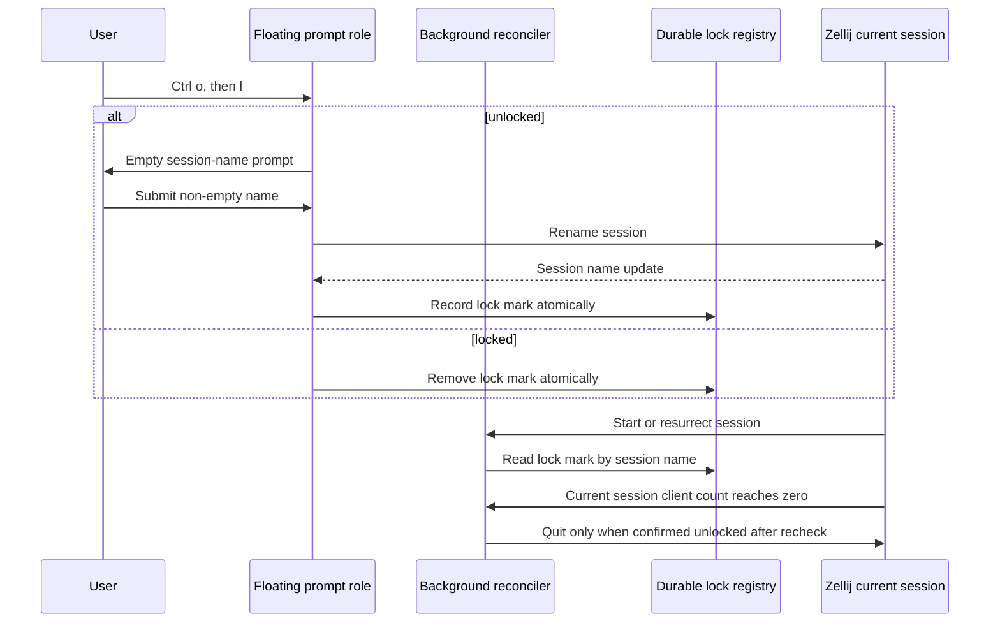

# Session Persistence - Plan

## Goal Capsule

- **Objective:** Add explicit session locking to `zellij-tab-namer` so disposable sessions quit when their last client leaves and intentionally locked, named workspaces remain available to reattach.
- **Product authority:** The Product Contract in this file is authoritative for session persistence behavior. Tab naming remains a related existing capability, not active scope except where it shares the plugin runtime.
- **Execution profile:** Code and tests belong in this repository. Its installer writes the session-mode keybinding, plugin wiring, baseline close behavior, and permission grants into the Zellij config repository, which is the consumer target rather than separate manual work.
- **Open blockers:** None.

---

## Product Contract

### Summary

Extend the headless tab-namer with a session-persistence state. New generated-name sessions are disposable by default. A user can lock a session through `Ctrl o`, then `l`, provide a deliberate name, and preserve that session when its last client leaves.

Unlocking reverses persistence without discarding the descriptive name.

The 2026-07-27 lifecycle amendment defines unlocked sessions as ephemeral:
terminal close, explicit detach, and switching sessions all quit an unlocked
session after its final client disconnects. `Ctrl o`, then `w` warns before
opening the session manager when the current session is unlocked.

### Problem Frame

Zellij can reconstruct panes and commands after an exited session, but it cannot retain the in-memory state of interactive tools such as Claude Code or Codex. Persisting every new session therefore keeps scratch work alive unnecessarily, while quitting every session loses active agent work that the user intended to return to.

The user needs one deliberate action that distinguishes a disposable session from a named workspace. That action must remain reliable after reattaching or resurrecting a session.

### Key Decisions

- KD1. **Lock state controls persistence.** A descriptive name alone does not make a session persistent. (session-settled: user-directed — chosen over name-implies-persistence: persistence must be an explicit mark.) Governs R1, R2, R6.
- KD2. **Lock prompts for a blank name.** The lock flow asks the user to type a deliberate session name rather than deriving one from pane context. (session-settled: user-directed — chosen over an inferred project label: the user wants intentional names.) Governs R3, R4.
- KD3. **Unlock retains the name.** Unlocking changes close behavior only. (session-settled: user-directed — chosen over restoring a generated name: the descriptive label remains useful.) Governs R5.
- KD4. **Extend `zellij-tab-namer`.** Session persistence shares the existing plugin's Zellij lifecycle, state access, and naming surface. (session-settled: user-approved — chosen over a separate session-lock plugin: one plugin avoids duplicate headless integration.) Governs R7.

<!-- ce-section: work-relationships -->
### How This Work Fits Together

This plan owns session lock behavior inside `zellij-tab-namer`. The broader Zellij workflow remains separately planned work.

- **Zellij config integration:** Depends on this feature; this repository's installer adds `Ctrl o` then `l`, plugin configuration, baseline close behavior, and the required permission grants to the config repository.
- **Existing tab naming:** Shares the plugin runtime but can proceed independently of session persistence.
- **Future session-name automation:** Still to decide; it is not required for explicit lock and must not turn fresh sessions into persistent workspaces.

### Actors

- A1. **User:** Starts disposable sessions and selectively preserves named workspaces containing active development or agent work.
- A2. **Session persistence capability:** Tracks whether the current session is locked, presents the lock-name and switch-guard interactions, and enforces ephemeral behavior after the last client leaves.
- A3. **Zellij runtime:** Renames the current session, reports client-count updates, launches the session manager, and later starts or resurrects sessions.

### Requirements

**Lock and unlock behavior**

- R1. A fresh session with a generated name must be unlocked and quit when its last client leaves through terminal close, explicit detach, or session switching.
- R2. `Ctrl o`, then `l` must toggle the current session's lock state.
- R3. Locking an unlocked session must open an interactive prompt with an empty name field.
- R4. A non-empty submitted name must rename and lock the current session, then preserve it when its last client leaves.
- R5. Unlocking a locked session must retain its current descriptive name and make it quit when its last client leaves.
- R6. Cancelling the lock prompt or submitting no name must leave the current session unlocked and unchanged.
- R6a. A submitted name must be non-empty, at most 64 characters, contain no control characters, and use only letters, digits, spaces, `.`, `_`, and `-`; rejected input leaves the prompt open and the session unchanged.

**Lifecycle and integration**

- R7. The existing `zellij-tab-namer` plugin must own session persistence alongside tab naming; no second headless plugin is required.
- R8. On startup, attach, or resurrection, the plugin must restore lock state only for a session previously marked locked.
- R9. Startup handling must not prompt for a name or automatically lock a fresh generated-name session.
- R10. The session-lock interaction must remain available after a user cancels it, unlocks, or reattaches to the session.
- R11. Opening the interaction must state whether the current session is locked or unlocked; successful changes and operational failures must be visible, retryable, and never silently change close behavior.
- R12. The installer must keep a static `on_force_close "detach"` baseline; the background plugin must quit only a confirmed-unlocked session after it was observed attached and later reaches zero clients.
- R13. `Ctrl o`, then `w` must warn before opening the session manager for an unlocked session, continue on Enter, cancel on Esc, and open the manager directly for a locked session.

```mermaid
stateDiagram-v2
  [*] --> Unlocked: fresh generated session
  Unlocked --> Naming: Ctrl o, then l
  Naming --> Unlocked: cancel or empty name
  Naming --> Locked: submit non-empty name
  Locked --> Unlocked: Ctrl o, then l
  Locked --> Locked: attach or resurrect; restore lock state
  Unlocked --> [*]: last client leaves; quit
  Locked --> Detached: last client leaves
  Detached --> Locked: attach
```

### Key Flows

- F1. Lock a session
  - **Trigger:** A1 presses `Ctrl o`, then `l` in an unlocked session.
  - **Actors:** A1, A2, A3.
  - **Steps:** A2 opens an empty name prompt. A1 submits a non-empty name. A2 renames the session, confirms the renamed session, and records the lock state.
  - **Outcome:** The named session remains running when its last client leaves.
  - **Covered by:** R2, R3, R4.

- F2. Cancel a lock attempt
  - **Trigger:** A1 dismisses the prompt or submits no name.
  - **Actors:** A1, A2.
  - **Steps:** A2 closes the interaction without changing the session name or lock state.
  - **Outcome:** The session remains disposable.
  - **Covered by:** R3, R6.

- F3. Unlock a session
  - **Trigger:** A1 presses `Ctrl o`, then `l` in a locked session.
  - **Actors:** A1, A2, A3.
  - **Steps:** A2 clears the lock state and restores ephemeral behavior without renaming the session.
  - **Outcome:** The session keeps its descriptive name but quits when its last client leaves.
  - **Covered by:** R2, R5.

- F4. Reattach or resurrect a locked session
  - **Trigger:** A3 starts a session that was previously locked.
  - **Actors:** A2, A3.
  - **Steps:** A2 recognizes the recorded lock state and restores it without opening the name prompt.
  - **Outcome:** A previously locked workspace remains persistent without startup friction.
  - **Covered by:** R8, R9, R10.

### Acceptance Examples

- AE1. **Covers R1.** Given a new generated-name session, when its last client closes, detaches, or switches away before the user locks it, then the session quits.
- AE2. **Covers R2, R3, R4.** Given an unlocked session, when the user presses `Ctrl o`, then `l` and enters `platform-review`, then the session is renamed `platform-review` and survives after its last client leaves.
- AE3. **Covers R3, R6.** Given an unlocked session, when the user opens the lock prompt and cancels or submits an empty value, then its name and close behavior remain unchanged.
- AE4. **Covers R2, R5.** Given locked session `platform-review`, when the user presses `Ctrl o`, then `l`, then the session keeps the name `platform-review` and quits after its last client leaves.
- AE5. **Covers R8, R9.** Given a previously locked session, when it is attached or resurrected, then it restores lock state without showing a naming prompt.
- AE6. **Covers R9.** Given a fresh generated-name session, when the plugin starts, then it neither prompts nor locks the session automatically.
- AE7. **Covers R11.** Given a session, when the user opens the interaction, then it identifies the current lock state; an invalid name or failed registry operation retains the input, shows a bounded error, and permits Enter to retry or Escape to dismiss.
- AE8. **Covers R13.** Given an unlocked session, when the user presses `Ctrl o`, then `w`, then a warning appears before the session manager; Enter continues and Esc leaves the session attached.

### Success Criteria

- A user can make a session persistent in one deliberate lock-and-name action.
- Leaving a session clientless preserves only sessions the user locked.
- A locked session stays recognizable by name after it is unlocked.
- The lock interaction is a reliable status check: it identifies whether leaving the session clientless will preserve or quit it before the user changes it.
- Reattaching or resurrecting a locked session does not require repeating the lock flow.

### Scope Boundaries

- Resuming the in-memory state of exited processes, including Claude Code and Codex, is outside scope.
- Automatic session names, project-derived prefill, and startup prompts for fresh sessions are outside scope.
- A separate session-lock plugin is outside scope.
- Session-sharing, multi-user lock ownership, and scheduled cleanup of unlocked sessions are outside scope.

### Dependencies / Assumptions

- Zellij 0.44 exposes current-session renaming, session/client updates, session-manager launch, and current-session quit commands to plugins.
- The plugin can persist lock state in a form that remains available when a session is reattached or resurrected.
- The floating interaction is a second, focused instance of the same WASM artifact opened by the session-mode binding; it does not depend on the headless instance rendering UI.
- The headless plugin's permission setup can safely include the permissions needed for lifecycle enforcement and its interactive roles.
- The Zellij config integration can bind `l` and replace the standard `w` session-manager binding without colliding with unrelated bindings.

### Sources / Research

- `rust/src/main.rs` and `rust/src/naming.rs` establish the existing native plugin's event-driven state and naming behavior.
- `config.kdl` in the dot-config repository has no session-mode `l` binding and already loads `zellij-tab-namer` headlessly.
- [Zellij plugin reconfigure API](https://zellij.dev/documentation/plugin-api-commands) supports changing runtime configuration for the current session.
- [Zellij session resurrection](https://zellij.dev/documentation/session-resurrection.html) documents that resurrection restores panes and commands, not in-memory interactive process state.

---

## Planning Contract

### Key Technical Decisions

- KTD1. **Use two roles of one WASM artifact.** The existing background instance reconciles named lock state at startup, while a floating instance handles the name prompt; both are `zellij-tab-namer` configurations. This fulfills KD4 and R7 without a second plugin.
- KTD2. **Persist lock marks in the package state file.** Extend the existing atomic JSON state store with a lock registry keyed by deliberate session name. The registry is the authority for R8; a session name by itself remains insufficient per KD1.
- KTD3. **Apply ephemeral behavior only after state is known.** Locking confirms the rename before recording the mark. Unlocking removes the mark before the background role may quit a clientless session. Unknown state preserves the session.
- KTD4. **Bind both interactions in session mode.** The installer manages `Ctrl o` then `l` as the lock prompt and replaces the standard `Ctrl o` then `w` session-manager binding with the switch-guard role while preserving unrelated keybindings and comments.
- KTD5. **Grant only the added capabilities.** WASM installation unions `RunCommands` and `OpenTerminalsOrPlugins` with the existing application-state grants; its macOS permission-cache backup and immutable-file handling remains unchanged.
- KTD6. **Make `detach` the installer-managed baseline.** Zellij captures `on_force_close` when the client attaches, so the installer reconciles one root `on_force_close "detach"` node. The background role observes `SessionUpdate`, arms only after seeing at least one client, and calls `quit_zellij` only when confirmed unlocked and still clientless after a bounded recheck.
- KTD7. **Use an explicit native-to-CLI protocol.** Installer configuration supplies an absolute state-file path and a validated `zellij-tab-namer` executable path to both WASM roles. The native side uses Zellij's argv API without a shell and calls `session-lock query|mark|unmark|cleanup --state-file <absolute-path> -- <session-name>`, receives one JSON result through `RunCommandResult`, and correlates it using a unique command context token. Names reject control characters, have a bounded length, and are passed only after the argument separator.
- KTD8. **Make lock state inspectable in the interaction.** The focused role opens with `Lock session` for an unlocked current session or `Unlock session: <name>` for a locked one. Success reports whether the session persists or quits after its last client leaves; invalid input and operational failures remain in the pane with the entered text and a bounded error. Enter retries the current action; Escape dismisses.
- KTD9. **Fail safely and recover visibly if the helper disappears.** A missing, moved, or invalid post-install helper response leaves lock state unknown, so the background role preserves the session. The focused role shows the failed executable path and a reinstall instruction; the background role emits one bounded diagnostic. Re-running installer repairs the managed absolute path.
- KTD10. **Serialize registry mutations.** The state-file writer takes an advisory per-user lock spanning load, update, atomic replace, and fsync so two concurrently running sessions cannot lose each other's lock marks. Reads tolerate a concurrent replace by retrying once before returning a bounded error.

### High-Level Technical Design

### Assumptions

- The installer validates the configured `zellij-tab-namer` executable before writing the role configuration; a missing executable aborts installation before configuration or permission mutation.
- Session names are unique among active and resurrectable sessions. A permanently deleted name can be reused only after its stale registry mark is removed by the session-lock command.
- The root configuration uses a static detach baseline. The headless role rechecks the durable registry when the final client leaves and quits only after confirming the session is unlocked.

### System-Wide Impact

- **Runtime:** The installer sets a global detach baseline. The background role quits only current sessions confirmed unlocked after their last client leaves.
- **Permissions:** Headless instances cannot accept their own prompt, so the installer must pre-grant the added permissions in `permissions.kdl` and preserve the repository's immutable-cache safety behavior.
- **Configuration:** The source repository owns installer support; the consumer config receives the baseline close behavior, generated session-mode binding, role settings, and permission grants on the next successful WASM installation.
- **State:** Lock entries are durable user intent. Failed registry operations leave lock state unknown, preserve the session, and show a bounded diagnostic rather than guessing. The native-to-CLI boundary uses JSON output, exit codes, and command-context tokens rather than parsing free-form diagnostics.

### Risks and Dependencies

- A registry entry can outlive a permanently deleted Zellij session and collide with a later reuse of the same name; expose a deliberate CLI cleanup path, document that it must be run before intentionally reusing a deleted locked name, and test it. This is an accepted limitation until Zellij exposes a durable per-session identity to plugins.
- Zellij has no transactional operation spanning rename, registry write, and client disconnect; use ordered, observable transitions and preserve the session whenever lock state is unknown.
- The floating prompt and headless reconciler share an artifact but not process memory; the registry, not plugin-local state, is their coordination boundary.

---

## Implementation Units

### U1. Durable session-lock registry and CLI contract

- **Goal:** Extend the existing state-file contract with atomic lock lookup, set, clear, and cleanup operations usable by both the Python CLI and native plugin.
- **Requirements:** R4, R5, R6, R8, R10; KD1, KD3.
- **Dependencies:** None.
- **Files:** `src/zellij_tab_namer/cli.py`, `tests/test_cli.py`, `README.md`.
- **Approach:** Preserve generated-tab state while adding a version-tolerant lock registry keyed by session name. Add `session-lock query|mark|unmark|cleanup --state-file <absolute-path> -- <session-name>` as a narrow non-interactive CLI contract. Each operation writes exactly one JSON object (`{"locked": boolean, "name": string}` on success; `{"error": string}` on failure), uses exit code 0 only for success, and holds an advisory per-user lock across load/update/atomic replace/fsync. Reject empty, invalid, control-character-containing, overlength, and ambiguous names before changing state.
- **Patterns to follow:** `_load_state`, `_save_state`, and command-runner injection in `src/zellij_tab_namer/cli.py`.
- **Test scenarios:**
  - A new lock mark survives a reload alongside existing generated-tab state.
  - Concurrent mark and unmark operations on different sessions preserve both resulting records rather than losing one writer's update.
  - Covers AE4. Removing a lock mark preserves the name record but reports the session as unlocked.
  - Empty names, unknown operations, malformed state, and failed writes leave prior state intact and return a nonzero result.
  - Option-like, quoted, and pasted names are validated and passed after `--`; they cannot add CLI options, change filesystem targets, or cause shell evaluation.
  - A stale-mark cleanup removes only the requested name and does not disturb other lock marks or generated tab entries.
  - Documentation and JSON output make a stale entry explicit; intentionally reusing a deleted locked name requires the cleanup command until Zellij supplies a durable session identity.
- **Verification:** CLI tests prove atomic state transitions and stable machine-readable results without a running Zellij server.

### U2. Native session reconciliation and floating prompt roles

- **Goal:** Add pure session-lock state decisions plus two WASM roles: a background reconciler and a focused empty-name prompt.
- **Requirements:** R1-R11; KD1-KD3, KTD7-KTD8.
- **Dependencies:** U1.
- **Files:** `rust/src/session.rs`, `rust/src/adapter.rs`, `rust/src/main.rs`, `rust/src/lib.rs`.
- **Approach:** Keep Zellij side effects behind adapter actions. The installer passes `session-lock-command` and absolute `session-lock-state-file` configuration values to all roles. Each registry operation invokes that validated absolute executable through Zellij's argv API (never a shell) with the exact U1 argument order and a unique `session-lock-op:<id>` context, subscribes to `RunCommandResult`, and accepts only a zero-exit, schema-valid JSON response carrying that context. The background role observes `ModeUpdate` and `SessionUpdate`, confirms durable lock state, and quits only an attached session that remains clientless after a recheck. The lock role owns naming and toggle input. The switch-guard role queries lock state, warns only when unlocked, and launches `zellij:session-manager` after Enter.
- **Execution note:** Implement the pure session transition table and regression tests before wiring Zellij events and rendering.
- **Patterns to follow:** `Adapter` action translation and pure coordinator tests in `rust/src/adapter.rs` and `rust/src/naming.rs`.
- **Test scenarios:**
  - Covers AE1 and AE6. An unmarked generated session yields no prompt and becomes eligible for ephemeral quit only after it has been observed attached.
  - Covers AE2. A valid non-empty submission produces ordered rename and registry actions.
  - Covers AE3. Escape or empty Enter produces only prompt-close behavior.
  - Covers AE4. An existing mark produces a clear-registry action while retaining the displayed name.
  - Covers AE5. A marked name on startup or resurrection restores locked state without opening a prompt.
  - A registry failure, invalid session name, missing rename observation, or denied permission preserves the session and emits one bounded diagnostic.
  - A post-install missing, moved, or malformed helper response preserves the session; the focused role shows the failed path and reinstall instruction with a retry/dismiss path.
  - Prompt key handling accepts normal text and paste, handles backspace, and never submits control characters or an empty name.
  - Covers AE7. The prompt displays the current status, renders success feedback, and preserves input plus a retry/dismiss path after an invalid name, denied permission, missing rename observation, or registry failure.
- **Verification:** Rust library tests cover every transition and action ordering; a live Zellij smoke test proves both plugin roles load from the same artifact.

### U3. Installer-managed wiring and permission migration

- **Goal:** Make WASM installation configure the session-mode toggle and all permissions needed by the native roles without breaking existing configs.
- **Requirements:** R2, R7, R10; KD4, KD5.
- **Dependencies:** U2.
- **Files:** `src/zellij_tab_namer/installer.py`, `tests/test_installer.py`, `src/zellij_tab_namer/cli.py`, `README.md`.
- **Approach:** Validate the configured native CLI executable before planning writes. Extend conservative KDL block editing to reconcile one root `on_force_close "detach"` node, add or reconcile the session-mode `l` binding, replace the standard session-mode `w` binding with the switch guard, and provide all roles the validated executable and absolute state-file configuration. Refuse ambiguous root nodes or unrelated `l`/`w` bindings. Extend effective WASM grants with the minimum session-lock permissions, preserve custom grants and comments, and retain all backup, rollback, symlink, and immutable-flag guarantees.
- **Patterns to follow:** `wire_zellij_config`, `update_permission_grants`, and installer rollback cases in `src/zellij_tab_namer/installer.py`.
- **Test scenarios:**
  - Given an unbound session mode, install adds one `l` binding that launches the prompt role and exits session mode.
  - Given the standard `w` session-manager binding, install replaces it with one switch-guard binding.
  - Given the managed binding and permissions already exist, a repeat install is a no-op.
  - Given an unrelated session-mode `l` or `w` binding or ambiguous KDL blocks, installation stops without partial mutation.
  - Given an existing root `on_force_close "quit"`, installation changes it to exactly one managed `detach` baseline; repeated installation is a no-op, and rollback restores the original bytes.
  - A missing configured CLI executable aborts before any config, artifact, or permission write; the generated role configuration contains the validated executable and absolute state-file path.
  - WASM grants include application-state, command, and floating-plugin capabilities while retaining existing grants.
  - Rollback restores original config and permission bytes plus the original immutable flag.
- **Verification:** Python installer tests validate idempotence, refusal paths, rollback, and planned permission output.

### U4. Documentation and end-to-end verification

- **Goal:** Document explicit session locking and prove the installed flow does not turn fresh sessions into persistent ones.
- **Requirements:** R1, R2, R8, R9; success criteria.
- **Dependencies:** U1-U3.
- **Files:** `README.md`, `CONCEPTS.md`, `docs/plans/2026-07-23-001-feat-session-persistence-plan.md`.
- **Approach:** Document the lock/unlock interaction, restart and permission behavior, the distinction between detach and resurrection, registry cleanup, and the boundary around interactive agent process state. Keep tab-naming documentation intact.
- **Test scenarios:**
  - A fresh installed session remains unlocked until the user invokes the toggle.
  - Lock, terminal close, reattach, unlock, and terminal close again demonstrate the required lifecycle; switch and explicit-detach cases cover the same last-client boundary.
  - A resurrection test confirms layout/context recovery expectations without claiming in-memory Claude/Codex recovery.
- **Verification:** The automated suites pass, a fresh-server smoke exercise succeeds, and documentation matches the shipped CLI and KDL surfaces.

---

## Verification Contract

| Scope | Evidence | Done signal |
| --- | --- | --- |
| Python state and installer behavior | Focused `unittest` suites | Registry operations, KDL edits, permissions, and rollback cover their acceptance scenarios. |
| Native state machine | Locked Rust library tests | Transition ordering, cancellation, registry failures, and startup repair are deterministic. |
| Artifact quality | Existing locked Rust format, lint, test, and WASM build gates | The same artifact shape accepted by CI builds successfully. |
| Live Zellij behavior | Fresh-server manual smoke | Locked sessions detach, unlocked sessions quit, and no fresh session is prompted automatically. |

## Definition of Done

- R1-R10 and AE1-AE6 are implemented and covered by automated tests where Zellij host behavior can be isolated.
- The installer safely wires the session-mode toggle and required permissions with repeatable rollback.
- The native artifact builds through the existing workflow.
- A fresh Zellij server demonstrates lock, reattach, unlock, and disposable-session behavior.
- README and Concepts distinguish session persistence from resurrection and from in-memory agent resumption.
